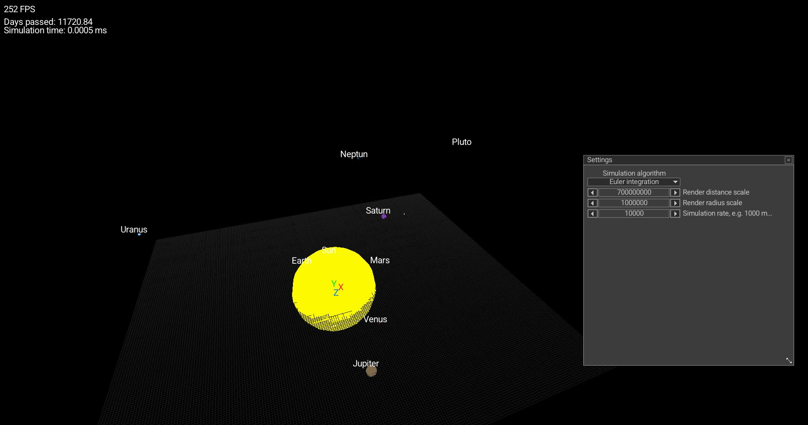

# 🌌 Zurvan
Zurvan is a real-time simulation of our solar system [Try the web build](https://cunterrainer.github.io/Zurvan/)

This project includes:

- Physics simulation: Models gravitational interactions and orbital mechanics between celestial bodies (like Earth, Sun, Mars etc.).

- Time control: Adjustable simulation speed (e.g., simulate thousands of hours per second).

- 3D visualization: Explore orbits and motion in a fully interactive 3D space using a free camera.

- Web support: Runs directly in the browser using WebAssembly.

- Modular design: Built with portability and extensibility in mind via Premake-based build system.



# Build Instructions
## Prerequisites
### Linux
Following libraries have to be installed and accessible to the current user:
- xorg (should contain:)
  - libx11
  - libxcursor
  - libxrandr
  - libxinerama
  - libxi

## Using premake
This project utilizes Premake as its build system, offering seamless integration with Visual Studio, Clang, and GCC. To set up the project, follow these steps:

## Clone the repository

``` bash
git clone https://github.com/cunterrainer/Zurvan.git
```
``` bash
cd Zurvan
```

## Visual Studio

``` bash
vendor\premake5.exe vs2022
```
This should generate a .sln file

## Make

Windows:
``` bash
vendor\premake5.exe gmake [--cc=gcc|clang]
```

Linux:
``` bash
vendor/premake5linux gmake [--cc=gcc|clang]
```

macOS:
``` bash
vendor/premake5macos gmake [--cc=gcc|clang]
```

⚠️ GCC is used by default on Linux/Windows. macOS uses Clang by default.  
⚠️ There are also other compilers available however building has only been tested with gcc, clang and msvc

## WebAssembly
There is already a precompiled build in `docs`, otherwise you have to build it yourself.

Before building it make sure `emscripten` is enabled in your current shell, to activate it use:
``` bash
emsdk activate latest
```

After activating generate `make` files
``` bash
vendor\premake5.exe gmake --os=emscripten
```

### Build

``` bash
make [-j] config=<configuration>
```

To see all available configurations:
``` bash
make help
```

## Additional Information
For more details on Premake options, use the following commands:

Windows:
``` bash
vendor\premake5.exe --help
```

Linux:
``` bash
vendor/premake5linux --help
```

macOS:
``` bash
vendor/premake5macos --help
```

## Troubleshooting
If you experience linking errors on Linux, resolve them by adding the necessary libraries to `Zurvan/premake5.lua`. Ensure these libraries are added before the last line in the file:

``` lua
filter {}
```

For linking errors, use this example:
``` lua
filter "system:linux"
    links {
        "GL",
        "X11",
        "rt",
        "dl",
        "m"
    }
```

For missing include directories, use this example:
``` lua
filter "system:linux"
    links {
        "GL",
        "X11",
        "rt",
        "dl",
        "m"
    }

    includedirs {
        "src/",
        "include/
    }
```

Make sure to tailor these adjustments to accommodate any specific libraries or directories required for successful compilation on the Linux platform.